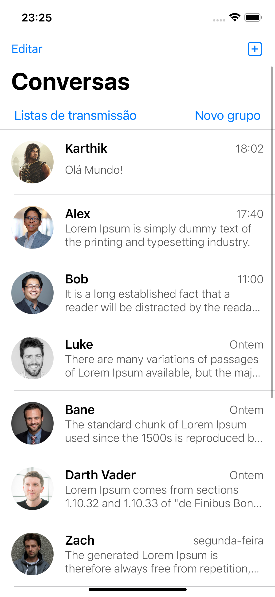

# Print

# API
https://run.mocky.io/v3/27f9cd5f-ae65-4379-bd48-6df65fa5177e

#  Mock

[
    {
        "image": "https://image.ibb.co/k0wVTm/profile_pic.jpg",
        "name": "Karthik",
        "lastMessage": "Olá Mundo!",
        "date": "18:02"
    },
    {
        "image": "https://image.ibb.co/cA2oOb/alex_1.jpg",
        "name": "Alex",
        "lastMessage": "Lorem Ipsum is simply dummy text of the printing and typesetting industry.",
        "date": "17:40"
    },
    {
        "image": "https://image.ibb.co/gSyTOb/bob_1.jpg",
        "name": "Bob",
        "lastMessage": "It is a long established fact that a reader will be distracted by the readable content of a page when looking at its layout.",
        "date": "11:00"
    },
    {
        "image": "https://image.ibb.co/jOzeUG/luke_1.jpg",
        "name": "Luke",
        "lastMessage": "There are many variations of passages of Lorem Ipsum available, but the majority have suffered alteration in some form, by injected humour, or randomised words which don't look even slightly believable.",
        "date": "Ontem"
    },
    {
        "image": "https://image.ibb.co/cBZPww/bane_1.jpg",
        "name": "Bane",
        "lastMessage": "The standard chunk of Lorem Ipsum used since the 1500s is reproduced below for those interested.",
        "date": "Ontem"
    },
    {
        "image": "https://image.ibb.co/j4Ov3b/darth_vader_1.png",
        "name": "Darth Vader",
        "lastMessage": "Lorem Ipsum comes from sections 1.10.32 and 1.10.33 of \"de Finibus Bonorum et Malorum\" (The Extremes of Good and Evil) by Cicero, written in 45 BC. This book is a treatise on the theory of ethics, very popular during the Renaissance.",
        "date": "Ontem"
    },
    {
        "image": "https://image.ibb.co/b4kxGw/zach_1.jpg",
        "name": "Zach",
        "lastMessage": "The generated Lorem Ipsum is therefore always free from repetition, injected humour, or non-characteristic words etc.",
        "date": "segunda-feira"
    },
    {
        "image": "https://image.ibb.co/eLVWbw/katie_1.jpg",
        "name": "Katie",
        "lastMessage": "All the Lorem Ipsum generators on the Internet tend to repeat predefined chunks as necessary, making this the first true generator on the Internet.",
        "date": "terça-feira"
    },
    {
        "image": "https://image.ibb.co/ncAa3b/chloe_1.jpg",
        "name": "Chloe",
        "lastMessage": "Aenean quis lectus nisl. In dapibus odio elit, ut aliquet est dapibus at.",
        "date": "terça-feira"
    },
    {
        "image": "https://image.ibb.co/fQKPww/kennith_1.jpg",
        "name": "Kennith",
        "lastMessage": "Maecenas ligula quam, dignissim eu dolor eu, accumsan ultrices libero. Quisque interdum mauris vitae mi sollicitudin porta.",
        "date": "quarta-feira"
    },
    {
        "image": "https://image.ibb.co/dM6hib/tara_1.jpg",
        "name": "Tara",
        "lastMessage": "Etiam quam dui, commodo at turpis non, suscipit facilisis lacus. Proin facilisis est sit amet congue fermentum.",
        "date": "quarta-feira"
    }
]

